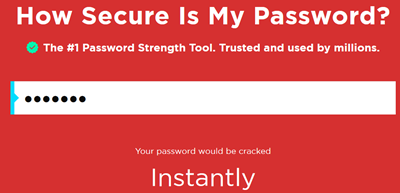
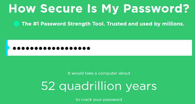

#AC/netsec 

- https://projects.raspberrypi.org/en/projects/password-generator


## Introduction:

It’s important to protect your personal information online, and in this project you’ll create a program to generate passwords for you.

```python
import random

print('''
Password Generator
==================
''')

chars = 'abcdefghijklmnopqrstuvwxyzABCDEFGHIJKLMNOPQRSTUVWXYZ!@£$%^&*().,?0123456789'

number = input('number of passwords?')
number = int(number)

length = input('password length?')
length = int(length)

print('\nhere are your passwords:')

for pwd in range(number):
  password = ''
  for c in range(length):
    password += random.choice(chars)
  print(password)
```


##  ✅How secure is your password?

A computer could try to guess your password by using ‘brute force’ – this means trying out lots of passwords until it guesses the right one.

Let’s find out how long it would take a computer to guess your password.

- Go to [www.security.org/how-secure-is-my-password/](https://www.security.org/how-secure-is-my-password/), which is a website for finding out how secure your passwords are.
- Type in “letmein” (Let me in) as the password. You’ll see that a computer would guess this password extremely quickly!



- There are some reasons why “letmein” isn’t a good password to use:
    - It’s a very **common** password (one of the 15 most used passwords). A computer would guess these first.
    - It contains words from the **dictionary**. A computer would also try these passwords first.
    - It’s very **short**. It would take a computer more time to guess a longer password.
    - It only contains **letters**. Passwords are more secure if they also contain numbers and punctuation.
- Try entering a dictionary word. How long would it take a computer to guess that password?

## ✅Challenge: Creating a better password

Can you enter a password that would take a computer more than 1,000 years to crack but isn’t too long to type?

> [!example]- Strong Password
> `This-is-not-easy:)`




## Random characters

Let’s create a program to choose a random character for your password.

- Open the blank Python template Trinket: [jumpto.cc/python-new](https://jumpto.cc/python-new).
- Create a list of characters, stored in a variable called `chars`.
- To choose a random character, you’ll need to `import` the `random` module.
- Now you can choose a random character from the list, and store it in a variable called `password`.
- Finally, you can print your (very short!) password to the screen.
- Test your project by clicking ‘run’. You should see a single random character on the screen.
- - If you run your program a few times, you should see different characters appear.
- A password isn’t very secure if it only contains letters. Add some numbers to your `chars` variable.
- Test your code again a few times, and you should see that sometimes a number is chosen.

**Code 1**
```python
import random

chars = "abcdefghijklmnopqrstuvwxyz0123456789"
passowrd = random.choice(chars)
print(password)
```
## ✅Challenge: Using numbers and punctuation

Can you improve your program, so that it also chooses from:

- Capital letters (A-Z)
- Numbers (0-9)
- Punctuation (!?.,-)

You’ll need to add to your `chars` variable. Remember to test your improved program!


## A random password

A single character isn’t very useful - let’s improve your program to create a longer password.

- To create a password, you will add random characters to it, one at a time. See **Code1**

You want to choose a random character 10 times. To do this, add the following code:

```python
import random

chars = "abcdefghijklmnopqrstuvwxyz0123456789"

passowrd = ""

for c in range(10):
passowrd = random.choice(chars)
print(password)
```

You should also indent (move in) the line to choose a random character, so that it happens 10 times.

To indent, press the ‘tab’ key.

```python
passowrd = ""
for c in range(10):
	passowrd = random.choice(chars)
print(password)
```

You need to use `+=` to **add** the new character to the password each time.

```python
passowrd = ""
for c in range(10):
	passowrd += random.choice(chars)
print(password)
```

Test your new code and you should see a password that’s 10 characters long.

## ✅Challenge: A longer password

Can you change your program so that it creates a verrrrrrrry long password?

`V2)JLOkpQ*^6WWowji53sv)l(KjPmmXATRn&?lh8R^(7.^ob`

## Choosing a password length

Some websites require passwords to be a certain length. Let’s allow the user to choose the length of their password.

- First, ask the user to input a password length, and store it in a variable called `length`.

```python
number = input('number of passwords?')
number = int(number)

length = input('password length?')
length = int(length)
```

- Use `int()` to turn the user’s input into a whole number.

```python
length = int(length)
```

- Use your `length` variable to repeat as many times as the user entered.

```python
length = input('password length?')
length = int(length)

password = ""
for c in range(length):
	password += random.choice(chars)
print(password)
```

- Test your code. The password created should be the length entered by the user.

**Output**

```
password length? 25
g1Gx5OLU£OrY9J(SQNAy8x$.V

password length? 5
v0p%E
```


## Lots of passwords

Let’s allow the user to create 3 passwords at once.

- Add this code to create 3 passwords:

```python
length = input('password length?')
length = int(length)

for p in range(3):
password = ""
for c in range(length):
	password += random.choice(chars)
print(password)
```

- Highlight the code for creating a password, and press tab to indent so that it repeats 3 times.

- Test your new code. You should now see 3 passwords of your chosen password length

**Output**

```
password length? 10
82U179D,E8
?P^FXfYYi!
udPl%RuBHm
```


## ✅Challenge: Choosing the number of passwords

Instead of always printing 3 passwords, can you allow the user to enter the number of passwords they want?

Here’s how your program should work:

**Output**

```
Password Generator
==================

number of passwords? 4
password length? 15
here are your passwords:
£rHUw233B&HNDT1
oG!TvMq0SVAwFp@
LoP$672&tso1LcH
tg6UD22lu6cI3fk
```


## More about passowords:
- https://xkcd.com/936/

Credit: This material is adapted from the Raspberry Pi Foundation and is licensed under [Creative Commons BY-NC-SA 4.0](https://creativecommons.org/licenses/by-nc-sa/4.0/).